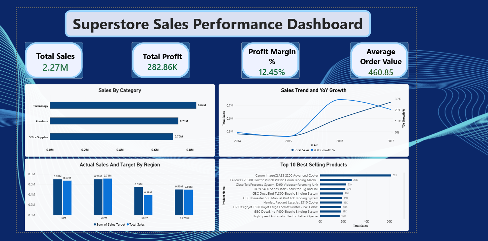

# 🛒 Superstore Sales Performance Dashboard

> *From raw transactions to a Star Schema — tracing sales data from MySQL all the way to an interactive Power BI dashboard.*

An end-to-end analytics project that takes ~9,700 retail transactions, cleans and models them properly, queries them with advanced SQL, and turns them into a dashboard that actually tells a business story — not just a pile of charts.

---

## 📌 The Problem

"How is the business doing?" is a deceptively simple question. Answering it properly means being able to:

- Query a real database, not just a spreadsheet
- Compare performance *year-over-year*, not just look at a single snapshot
- Know whether each region is hitting its targets or falling behind
- Build a data model that doesn't fall apart the moment someone adds a new table

This project was built to practice exactly that — the full pipeline a Data Analyst actually works in, end to end.

---

## 🗂️ Dataset

**Sample Superstore Dataset** (the same one used across most Tableau/Power BI tutorials and widely recognized in the DA community)

- ~9,700 retail order records
- Order details, customer info, product categories, regional sales, profit, and discounts

📎 Source: [Kaggle — Superstore Dataset](https://www.kaggle.com/datasets/vivek468/superstore-dataset-final)

---

## 🛠️ Tech Stack

`MySQL` · `MySQL Workbench` · `Power BI Desktop` · `DAX` · `Power Query` · `Star Schema Data Modeling`

---

## 🧱 Part 1: SQL (MySQL)

Raw CSV data was imported into MySQL and queried directly — no shortcuts through pre-cleaned spreadsheets.

### What I did:

1. **Fixed date formatting** — converted text-based date columns into proper `DATE` type using `STR_TO_DATE()`, enabling all downstream time-based analysis
2. **Aggregation & Grouping** — category-wise sales and profit breakdowns
3. **Window Functions** — used `RANK() OVER (PARTITION BY ...)` to find the top-selling product *within each category*, not just overall
4. **CTEs (Common Table Expressions)** — wrapped ranked results in a `WITH` clause to cleanly filter down to just the #1 product per category (something a plain `WHERE` clause can't do on a window function result)
5. **LAG() for Year-over-Year Growth** — calculated YoY Sales Growth % by pulling the previous year's total into the same row using `LAG()`, a pattern used constantly in real business reporting
6. **JOIN** — built a small `region_targets` reference table and joined it against actual sales to calculate target achievement % per region

### Sample Insight — Top Product Per Category (via CTE + Window Function)

| Category | Top Product | Total Sales |
|---|---|---|
| Technology | Canon imageCLASS 2200 Advanced Copier | ₹61,599.82 |
| Office Supplies | Fellowes PB500 Electric Punch Binding Machine | ₹27,453.38 |
| Furniture | HON 5400 Series Task Chairs for Big and Tall | ₹21,870.58 |

### Sample Insight — Year-over-Year Sales Growth

| Year | Total Sales | YoY Growth |
|---|---|---|
| 2014 | ₹481,763.80 | — |
| 2015 | ₹464,426.24 | -3.6% |
| 2016 | ₹601,265.26 | **+29.46%** |
| 2017 | ₹724,994.56 | +20.58% |

---

## ⭐ Part 2: Power BI — Star Schema & DAX

Instead of dumping one flat table into Power BI, the data was properly modeled into a **Star Schema**:

```
                Products
                    |
Customers ---- Orders (Fact Table) ---- Region_Targets
                    |
                DateTable
```

### What I did:

1. **Connected Power BI directly to MySQL** — no CSV middle-man, queried live from the database
2. **Split the flat table into Fact + Dimension tables** using Power Query (`Orders` as the Fact table; `Products`, `Customers`, `Region_Targets` as Dimension tables), then manually built 1-to-Many relationships
3. **Built a dedicated Date Table** using `CALENDAR()` and marked it as an official Date Table — required for Time Intelligence functions to work correctly
4. **Wrote 6 DAX measures**, including:
   - `Total Sales`, `Total Profit`, `Average Order Value`
   - `Profit Margin % = DIVIDE([Total Profit], [Total Sales], 0)`
   - `Sales PY = CALCULATE([Total Sales], SAMEPERIODLASTYEAR(DateTable[Date]))` — the DAX equivalent of the SQL `LAG()` approach, but using native Time Intelligence
   - `YoY Growth % = DIVIDE([Total Sales] - [Sales PY], [Sales PY], 0)`
5. **Designed an interactive dashboard** with KPI cards, a dual-axis trend chart (Sales + YoY Growth on separate axes), and Actual vs Target comparisons by region

---

## 📊 The Dashboard



**At a glance:**
| KPI | Value |
|---|---|
| Total Sales | ₹2.27M |
| Total Profit | ₹282.86K |
| Profit Margin | 12.45% |
| Average Order Value | ₹460.85 |

---

## 💡 Key Insights

### 1. Technology leads, but not by a landslide
Technology brings in the highest sales (₹0.84M), narrowly ahead of Furniture (₹0.73M) and Office Supplies (₹0.70M) — the business isn't over-reliant on a single category.

### 2. 2016 was the turning point
After a slight dip in 2015 (-3.6%), sales grew **29.46% in 2016** and continued growing **20.58% in 2017** — suggesting whatever changed operationally in 2016 is worth digging into further.

### 3. Regional performance is uneven
Using a custom target benchmark, East and West are tracking close to target, while South is sitting around 70% of its target — a clear candidate for regional strategy review.

### 4. A handful of products drive outsized revenue
The top-selling product (Canon imageCLASS 2200 Advanced Copier) alone generated over ₹61K — more than double the next closest competitor in Office Supplies.

---

## 🧗 A Debugging Note (Because Real Projects Have These)

Time Intelligence functions initially returned flat `0.00%` everywhere. Turned out there were **two different date columns** in the Fact table — a leftover text-based `Order Date` from an earlier cleanup step, and the proper `Order_Date` column the DAX measures were actually referencing — and the Power BI relationship had quietly linked to the wrong one. Lesson: when a calculation returns suspiciously uniform results, check for duplicate columns before assuming the formula is wrong.

---

## 📁 Files in This Repo

- `Superstore_Sales_Dashboard.pbix` — full Power BI file (data model, DAX measures, dashboard)
- `superstore_sql_queries.sql` — all SQL queries used (cleaning, window functions, CTEs, JOIN)
- `dashboard_screenshot.png` — final dashboard preview

---

## 🎯 What I'd Do Next

- Automate the SQL → Power BI refresh pipeline with scheduled refresh
- Add a Customer Segmentation (RFM) analysis
- Bring in a discount-vs-profit analysis to flag which discount levels are actually eating into margins

---

*Second project in my transition into Data Analytics — this one focused on going past spreadsheets into proper databases, data modeling, and DAX.*
